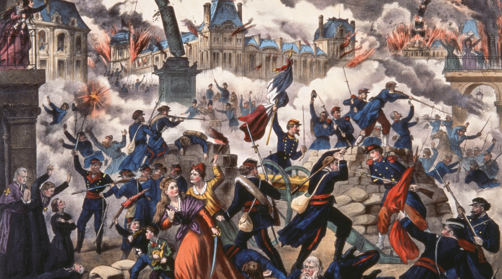

Engels a scris acest scurt eseu în 1872, pe vremea când disputele dintre Marx și Bakunin (liderul facțiunii anarhiste a Primei Internaționale) deveneau tot mai pronunțate. Pe scurt, cei doi aveau viziuni diferite cu privire la conceptul de autoritate și la necesitatea autorității în vederea construirii socialismului.

## 💭 Definiția lui Engels

Având în vedere că anarhiștii par să aibă mai degrabă o problemă cu termenul de autoritate în sine, condamnând orice strategie care face uz de el, Engels începe prin a-l defini. Pentru marxiști, autoritatea se referă la impunerea voinței unor oameni asupra altor oameni prin subordonare. Mai departe, întrebarea este dacă se poate evita vreodată, complet, nevoia de autoritate.

## 👁️ Autoritatea în Cadrul Muncii

Manevrarea utilajelor din fabrici duce automat la nevoia de organizare detaliată a muncitorilor, iar aceasta nu se poate realiza decât prin intermediul autorității, așa cum este definită ea mai sus. Engels oferă trei scenarii concrete, fiecare cu particularitățile sale: manevrarea filaturii de bumbac, supravegherea căilor ferate și situațiile de urgență pe vapor. Ultimul scenariu este un exemplu perfect în care viețile tuturor depind de obediența absolută și instantanee față de un singur individ. O altă remarcă interesantă este că până și votul prin majoritate, în vederea luării unei decizii, reprezintă o formă de autoritate, deoarece suprimă voința indivizilor minoritari în favoarea voinței colective a majoritarilor.

## 🏭 Autoritatea ca Rezultat al Condițiilor de Producție

Modul de producție capitalist tinde să înlocuiască acțiunea izolată cu acțiunea combinată a mai multor indivizi, care, după cum am văzut deja, necesită organizare și autoritate. Autoritatea se naște așadar tocmai din condițiile materiale de producție. Supunerea muncitorilor în conformitate cu nevoile utilajului manevrat face ca mașinăriile din fabrici să fie mult mai despotice decât orice mic capitalist a fost vreodată. Abolirea autorității înseamnă deci însăși abolirea producției, așa cum o cunoaștem astăzi, și revenirea la comunismul primitiv.

## 🏙️ Autoritatea în Organizarea Socială

Am stabilit că o formă sau alta de autoritate este obligatorie. Prin urmare, autoritatea și autonomia devin noțiuni relative, neputând fi niciodată absolut bune sau absolut rele. Acestea fiind spuse, organizarea socială a viitorului trebuie totuși să restricționeze autoritatea la limitele impuse de condițiile de producție. În societatea burgheză capitaliștii depășesc aceste limite, exercitându-și autoritatea inclusiv asupra producției și circulației bogățiilor, toate acestea în numele profitului, iar nu pentru bunăstarea populației.

## 🚩 Autoritatea în Revoluție

Engels încheie eseul explicând perspectiva marxistă asupra autorității în cadrul revoluției. El spune că oricum statul, împreună cu autoritatea sa politică, se va diminua treptat în urma revoluției, până la dispariția sa completă. Însă revoluția în sine este cel mai autoritar act posibil, în care o parte a populației își impune voința asupra celorlalți prin intermediul armelor, iar mai apoi, pentru ca eforturile să nu fi fost în zadar, își apără puterea câștigată tot prin arme, așa cum s-a întâmplat în cazul Comunei din Paris.

Pe de cealaltă parte, anarhiștii vor abolirea _imediată_ a statului, iar nu doar înlocuirea caracterului său de clasă, adică înlocuirea dictaturii burgheze cu cea proletară. Această paradigmă este idealistă, deoarece nu așteaptă ca condițiile materiale ce au dus în primul rând la apariția statului să dispară.

## 🏴 Perspectiva lui Bakunin

Pentru a înțelege și punctul de vedere al anarhiștilor, am citit apoi și eseul **What Is Authority?**, scris de Bakunin cu doi ani înaintea lui Engels. Bakunin spune că singura autoritate pe care o permite este cea a științei _absolute_, pe care o descrie făcând o analogie între religie și știință. Așa cum vede inoportun să le acordăm autoritate deplină _reprezentanților_ lui Dumnezeu, adică preoților, la fel vede total greșit să acordăm autoritate totală oamenilor de știință, care uneori pot greși, neputând vreodată să fie reprezentanți perfecți ai științei.

Bakunin insistă pe faptul că autoritatea omului asupra omului este sursa tuturor relelor (fără vreo motivație materialistă, din punctul meu de vedere) și că trebuie abolită cu orice preț. Totodată, consideră că autoritatea poate fi acceptată, dar neapărat cu condiția să fie _voluntară_, și nu impusă. Spre exemplu, atunci când întâmpină o problemă într-un domeniu în care nu are expertiză, se consultă cu experți din domeniul respectiv, însă își rezervă mereu dreptul la critică în privința sfaturilor oferite de aceștia. Fragmentul de față m-a dus imediat cu gândul la discursul antivacciniștilor, la care cred că se pretează foarte bine.

Am căutat și alte argumente antiautoritare, din partea altor anarhiști, dar toate par să trateze noțiunile de autoritate și stat în mod metafizic, nu prin dialectica contradicțiilor dintre clase, și punând mereu moralitatea deasupra materialismului.
