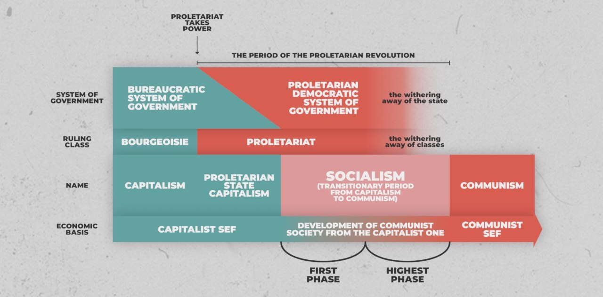

**Tezele din Aprilie** sumarizează planul de acțiune al lui Lenin pentru trecerea de la revoluția burghezo-democratică din februarie la cea proletară, ce avea să aibă loc în octombrie.

## 👑 Teza 1

Socialiștii trebuie să se opună vehement războiului (Primul Război Mondial), deoarece, datorită naturii burgheze a guvernului provizoriu, acesta rămâne un război imperialist de jaf. El poate fi transformat într-un război revoluționar, de defensivă, doar sub următoarele trei condiții:

1. Puterea să treacă în mâinile proletariatului și țărănimii.
2. Să se renunțe la toate anexările.
3. Să se rupă orice sprijin al intereselor capitalului.

Cu alte cuvinte, în război, cel mult ne vom apăra, însă doar dacă avem niște idealuri socialiste de apărat, iar nu capitalul burgheziei.

## 🚩 Teza 2

Prima fază a revoluției, cea burghezo-democratică, a fost necesară doar datorită insuficienței conștiinței de clasă în rândul proletariatului. Prin urmare, trecerea la a doua fază, cea proletară, necesită mult mai multă educare și coordonare a maselor.

## 🏢 Teza 3

Socialiștii trebuie să arate lipsa de susținere față de guvernul provizoriu, care, prin sprijinul său față de război, este un guvern imperialist.

## ✊ Teza 4

În cadrul sovietelor, socialiștii sunt o minoritate. Ei trebuie să expună constant greșelile fundamentale și spiritul mic-burghez al social-democraților, pentru a atrage majoritatea muncitorilor de partea lor.

## 🪆 Teza 5

Socialiștii nu doresc o republică parlamentară, ci o republică a sovietelor. Se reiau ideile din [**Despre Dualitatea Puterii**](/note/despre-dualitatea-puterii/), publicat la câteva zile distanță.

## 🚜 Teza 6

De programul agrar trebuie să se ocupe Sovietele de Agricultori. Acesta constă din:

1. Confiscarea tuturor moșiilor funciare.
2. Naționalizarea tuturor terenurilor.

## 🏦 Teza 7

Toate băncile din țară trebuie unificate imediat într-o singură bancă națională, pusă sub controlul Sovietelor de Muncitori.

## 🛍️ Teza 8

Socialiștii nu cer introducerea instantanee a socialismului, ci punerea producției și distribuției în mâinile Sovietelor de Muncitori, chiar dacă baza economică rămâne momentan capitalistă. Mai jos adaug toate etapele unei revoluții socialiste, pentru clarificare -- schemă realizată de tovarășii de la [Editura Comunism Științific](https://www.instagram.com/comunism.stiintific/).

## 📢 Teza 9

Sarcinile partidului sunt:

1. Convocarea imediată a congresului.
2. Modificarea programului de partid în privința anumitor aspecte lămurite anterior.
3. Schimbarea numelui în Partidul Comunist, deoarece partidele social-democrate deja trădaseră interesele muncitorilor în mai toată lumea.

## 🌍 Teza 10

Este nevoie de o nouă internațională comunistă, una revoluționară.

## 🚨 Acuzații Aduse Lui Lenin

Opoziția social-democrată l-a acuzat pe Lenin că instigă la război civil „în mijlocul unei democrații revoluționare” (inexistente), când el de fapt doar critica opoziția pentru refuzul ei de a se opune guvernului provizoriu.

De asemenea, opoziția l-a acuzat că se opune convocării urgente a Adunării Constituante, când el doar spunea că întrunirea nu poate avea loc fără prezența sovietelor, care nu erau invitate. Delegații Adunării Constituante au fost aleși pe timpul monarhiei, cu scopul de a crea o constituție permanentă. Aceștia au fost convocați pentru prima oară abia în ianuarie 1918, când au refuzat să recunoască guvernul sovietic, iar ca urmare Adunarea s-a dizolvat.

Lenin încheie citând-o pe Rosa Luxemburg, care în 1914 a declarat că social-democrația germană a devenit un „hoit împuțit”.
