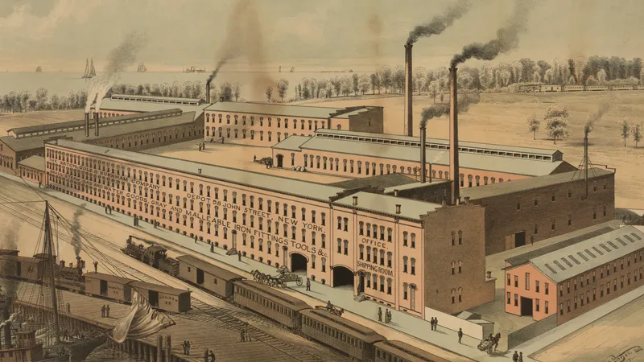
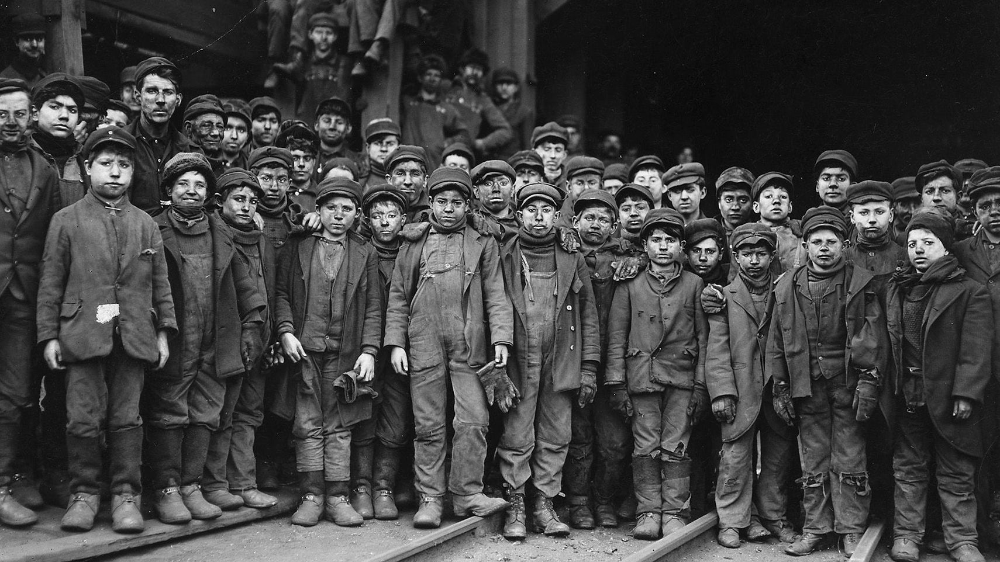
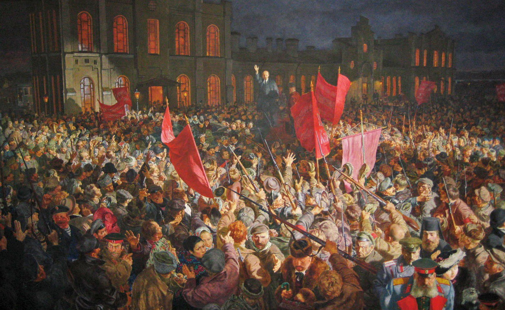

Acest eseu este un precursor al [**Manifestului Partidului Comunist**](/note/the-communist-manifesto/), având un conținut similar, dar fiind considerabil mai scurt. Lucrarea este structurată pe 25 de întrebări și răspunsuri, pe care eu le-am grupat în cinci secțiuni, rezumate în cele ce urmează.

## 🔨 1-5: Comunismul și Proletariatul

Comunismul este doctrina condițiilor de eliberare a proletariatului. Proletariatul este acea clasă socială care trăiește exclusiv din vânzarea forței sale de muncă și care nu obține profit de pe urma niciunui soi de capital. Istoric vorbind, proletariatul este clasa muncitoare a secolului XIX. Au existat și în trecut clase muncitoare, majoritatea sărace, însă proletariatul este unic prin prisma condițiilor materiale ale existenței sale economice.

Proletarii își au originea în Revoluția Industrială, care a avut loc în Anglia, în a doua jumătate a secolului XVIII, iar de atunci a fost exportată în toate țările civilizate. Aceasta a fost cauzată de apariția a tot felul de utilaje mecanice, care, fiind foarte scumpe, puteau fi cumpărate doar de către marii capitaliști. Aceste utilaje au ajuns, peste noapte, să producă bunuri mult mai ieftine și calitative decât vechii muncitori, ale căror puține unelte deținute au devenit complet inutile. Așa a ajuns întreaga producție în mâinile capitaliștilor (deținătorilor de capital).

Munca în fabrică devenea tot mai divizată, astfel că sarcinile muncitorilor deveneau tot mai simple și repetitive, ajungând în cele din urmă, rând pe rând, să fie executate de mașinării. Industrializarea a ruinat vechea clasă mijlocie, creând două clase care le înghițeau treptat pe toate celelalte: burghezia (marii capitaliști) și proletariatul (muncitorii lipsiți de proprietăți).

Munca este o marfă, iar ca orice marfă, prețul ei este determinat de costul necesar producerii, care de fapt este egal cu minimul necesar pentru asigurarea subzistenței muncitorului. Această lege economică se aplică tot mai strict pe măsură ce capitalul devine tot mai monopolist.

## 🪚 6-10: Proletariatul vs. Alte Clase Muncitoare

Față de **sclav**, care este cumpărat odată pentru totdeauna, proletarul trebuie să se vândă zilnic și oră de oră. Existența sclavului, oricât de mizerabilă ar fi, este asigurată de stăpânul său, însă cea a proletarului, ca individ, nu. Doar proletariatul, ca întreagă clasă, are o existență garantată. Sclavul nu are de a face cu competiția acerbă dintre capitaliști, pe când proletarul o simte din plin pe propria piele.

**Iobagul** deține un mijloc de producție (pământul), lucrează pentru el însuși și _renunță_ la o parte din produs pentru stăpân. În contrast, proletarul _nu_ deține niciun mijloc de producție, lucrează pentru capitalist și _primește_ o parte din produs înapoi de la dumnealui.

**Meșteșugarul** este, cel puțin temporar, un proletar. Unul care visează să acumuleze suficient capital cât să ajungă să exploateze alți muncitori, luând și el parte la competiția dintre capitaliști. În funcție de gradul succesului ulterior, el va sfârși fie ca burghez, fie ca proletar.

## 🏭 11-13: Consecințele Revoluției Industriale

În urma Revoluției Industriale, toate țările semi-barbare, chiar și cele care pentru mii de ani nu au cunoscut niciun fel de progres, au fost forțate să iasă din izolarea lor față de restul lumii, deoarece importul de marfă ieftină din Anglia a băgat în faliment vechile lor industrii de manufactură. O mașinărie apărută în Anglia a ajuns peste noapte să lase milioane de chinezi fără loc de muncă. Piețele locale s-au transformat într-o mare piață globală, iar orice schimbare din țările civilizate a ajuns să aibă repercusiuni în tot restul lumii.

Membrii societății au ajuns să fie inegali în exact aceeași măsură în care capitalul lor este inegal. Burghezia a devenit clasa privilegiată și a început să-și manifeste dominația politică prin sistemul reprezentativ, care le oferă burghezilor egalitate în fața legii și le recunoaște dreptul la liberă competiție. Interesant că la vremea acestui text, doar oamenii cu suficient capital aveau dreptul la vot.

Proletariatul se dezvoltă simultan cu burghezia. Cu cât capitalul burgheziei crește, cu atât proletarii cresc ca număr. Cu cât capitalul devine mai concentrat în tot mai puține mâini, cu atât proletariatul devine mai concentrat în mari centre industriale, pentru că acolo producția la scară largă se desfășoară cel mai eficient.

Competiția turbată dintre capitaliști duce la supraproducție, astfel că surplusul de marfă nu mai poate fi cumpărat, iar o nouă criză comercială are loc. Fabricile se închid, capitaliștii înfrânți dau faliment, iar proletarii rămân fără pâine de pus pe masă. Cu timpul, marfa respectivă ajunge în cele din urmă să fie vândută, iar o nouă perioadă de prosperitate începe, chiar mai luminată ca niciodată. Apoi ciclul de repetă, cu o periodicitate de 5-7 ani la vremea textului de față.

În trecut, forțele de producție nu erau suficient de dezvoltate încât să poată asigura suficiente bunuri pentru toată lumea, astfel că existența a două clase antagoniste era inevitabilă. Însă, în societatea capitalistă din prezent, acest lucru poate fi schimbat pentru prima oară. Dar pentru asta este nevoie de o nouă orânduire socială, în care producția să nu mai fie îngenunchiată de competiția extremă și risipitoare din prezent.

## 🚩 14-23: Revoluția Socialistă

Sarcina principală a revoluției socialiste este abolirea proprietății private. Aceasta trebuie înlocuită cu deținerea și operarea mijloacelor de producție în comun, cu un plan comun și de către toți membrii societății. Abolirea proprietății private nu poate avea loc instantaneu, ci gradual, până când forțele de producție vor atinge nivelul de dezvoltare necesar. Printre măsurile propuse în acest sens se numără taxarea progresivă, impunerea de taxe mari pe moștenire și exproprierea graduală a capitaliștilor, parțial prin punerea lor în competiție cu statul, parțial compensându-i prin obligațiuni.

Revoluția nu poate avea loc în mod izolat, într-o singură țară, ci trebuie să se dezvolte simultan pe întreg globul, căci lumea este deja puternic interconectată, iar capitalul nu cunoaște granițe. Engels credea că revoluția va porni din cele mai dezvoltate țări, pentru că acolo proletarii reprezintă majoritatea covârșitoare, însă istoria ne-a demonstrat că s-a înșelat.

În urma revoluției, progresul tehnologic va fi pentru prima oară un lucru benefic pentru întreaga societate. Oamenii vor fi multilateral dezvoltați, deoarece hiperspecializările necesare muncii exagerat de divizate din fabrică se vor dovedi inutile. Vom fi familiarizați din școală cu întregul sistem de producție, așa că vom putea trece ușor de la o ramură a sa la alta, în funcție de nevoile curente ale societății și de înclinațiile noastre.

Odată cu abolirea proprietății private și cu educarea copiilor într-un mod comunal, vor dispărea dependența soției de soț și cea a copiilor de părinți. Prostituția, înrădăcinată și ea în proprietatea privată, va dispărea de asemenea. Statele guvernate pe principii comuniste se vor unifica, distincțiile de naționalitate ajungând în final la fel de inutile precum cele de clasă. Toate religiile de până acum au fost expresia diverselor etape de dezvoltare a societăților omenești; în comunism însă, religiile nu vor mai avea niciun folos, așa că se vor evapora și ele de la sine.

## 🌹 24-25: Comuniștii vs. Socialiștii

Socialismul **reacționar** este al celor care văd relele din societatea capitalistă și, având impresia că societatea feudală era lipsită de aceste rele (ignorând că, oricum, avea destule altele), vor să ne întoarcem la ea. Asta presupune, între altele, restaurarea monarhiei și aristocrației, iar nicidecum o îmbunătățire a traiului proletarilor.

Socialismul **burghez** este al celor care aderă la societatea curentă, dar sunt ușor speriați de relele care, ce să vezi, sunt provocate chiar de către aceasta. Ei vor să le rezolve prin fel de fel de reforme, însă păstrând neapărat aceeași bază economică. Vor un capitalism cu față umană, deci cred că nu greșesc dacă pun egal între ei și social-democrați.

Socialismul **democratic** implică unele măsuri, uneori radicale, la care aderă și comuniștii, dar nu pentru schimbarea revoluționară a societății, ci doar pentru corectarea ei. Acești socialiști sunt fie mici burghezi, fie proletari care mai au de lucru la conștiința lor de clasă. Față de cei reacționari și cei burghezi, socialiștii democrați sunt singurii cu care comuniștii pot colabora.

Lucrarea se încheie cu o serie de poziții ale comuniștilor față de marile partide politice ale Europei de la acea vreme. Esența este că, mai întâi, trebuie colaborat cu partidele liberale, burgheze, pentru răsturnarea monarhiei, acolo unde aceasta încă mai există. Lupta dintre proletari și burghezi trebuie să înceapă imediat cum cea dintre burghezi și autocrați ia sfârșit.
