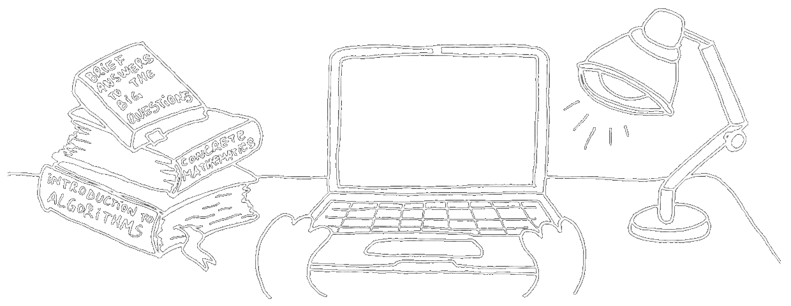
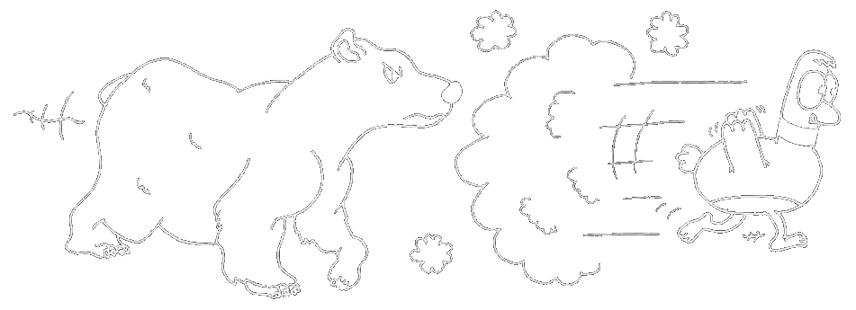

import SocialLinks from '../../components/home/SocialLinks.astro'

## 🦆 Cine Sunt?

Numele meu este **Iulian Oleniuc** (AKA **Gareth, Rățoiul Verde**), am {new Date() < new Date(new Date().getFullYear(), 2, 21) ? new Date().getFullYear() - 2003 : new Date().getFullYear() - 2002} de ani și sunt student la masterul de Studii Avansate în Informatică din cadrul UAIC, unde pretind că fac research în zona de criptografie, mai precis pe tema **Key-Policy Attribute-Based Encryption**. Mă pasionează matematica, marxismul și cultura hip-hop (cu precădere cea autohtonă).

În afara facultății, care îmi mănâncă zilele, îmi ocup timpul cu activități algoritmice (scris pe InfoGenius, predat la InfoGym, organizat FIICode, comisii OJI/ONI, pregătiri), citind Eric Schmitt și contemplând marii gânditori ai istoriei, de la Karl Marx până la Kazi Ploae. Din când în când, mă regăsesc făcând web dev, lucrând la site-uri precum cel de față. Totodată, în funcție de sezon, mai ies pe afară cu bicla sau mai merg în câte o excursie.

## 🛠️ Ce Am Făcut?

- În liceu, am luat o medalie de argint 🥈 și una de bronz 🥉 la ONI.
- Timp de 4 ani, am făcut parte din comisia științifică a concursului **FIICode**.
- Timp de 3 ani, am ținut lecții la cercul de informatică **InfoGym -- Hai la Olimpiadă**.
- Timp de 1 an, am ținut pregătiri la informatică pentru OJI, ONI și admitere.
- Timp de 1 an, am fost membru în comisia științifică ONI pentru clasa a 6-a.
- Timp de 1 semestru, am predat Proiectarea Algoritmilor la două grupe.
- Am realizat site-ul pentru [**Crucea Roșie Iași**](https://crucearosieiasi.ro/).
- Am participat la un program Erasmus+ în Baena, Spania.
- Am participat ca antrenor la două tabere ICPC în Osijek, Croația, și în Wrocław, Polonia.
- Am participat ca antrenor la SEERC 2024, în București.

## 🤔 Chestii Random

- Odată [am petrecut 3 ore](/post/intalnire-cu-un-bagabont/) vorbind despre marxism cu un bagabont de pe stradă.
- În clasele 7-8 eram un membru de vază al [**ClubPTC**](https://facembani.ro/) -- comunitatea șomerilor români care fac bani online din crypto, site-uri paid-to-click, scheme MLM și altele asemenea.
- Prima mea linie de cod am scris-o în clasa a 3-a la Palatul Copiilor, în răposatul limbaj Turbo Pascal.
- Lucrez din 2017 la blogul meu despre informatică și programare [**InfoGenius**](https://infogenius.ro/), unde n-am mai scris de 2 ani.
- Ascult hip-hop din clasa a 7-a, când profa de desen ne-a pus la videoproiector piesa [**Without Me**](https://www.youtube.com/watch?v=YVkUvmDQ3HY).
- Pot să-mi pocnesc genunchiul drept aproape oricând îmi doresc.
- În clasa a 10-a am făcut Educație Antreprenorială cu un prof care ne îndemna să citim sfânta scriptură a capitalismului **Tată Bogat, Tată Sărac** și să cumpărăm Bitcoin și Ripple pentru a ajunge pe lună.
- În tinerețe am scris un plugin pentru WordPress în PHP.
- O singură dată am încercat să copiez la un test, însă nu mi-am aflat nota, căci profa a decedat ulterior.
- De la singurul meu job oficial am fost concediat telefonic de către șeful aflat în concediu la mare.
- În gimnaziu am creat o serie de benzi desenate intitulate **Gareth, Rățoiul Verde**, despre un rățoi de 60 KG.
- În BAC la română am luat nota 7,50. Contestația a mărit-o la 8,20, dar prefer să mă laud cu nota dintâi.
- În clasa a 5-a am obținut punctajul 99,50 la DELF A1. Acum nu mai știu o boabă de franceză.
- În clasa a 8-a am fost într-o tabără unde Mircea Cărtărescu mi-a spus că ar trebui să zâmbesc mai des.

## 🔗 Link-uri Utile

<SocialLinks />
