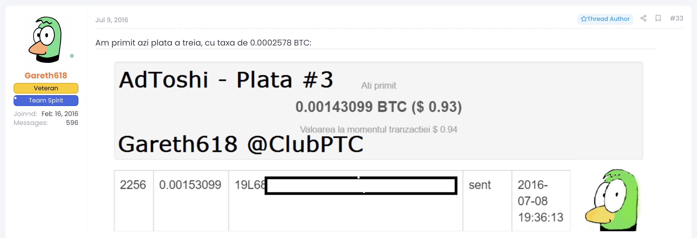
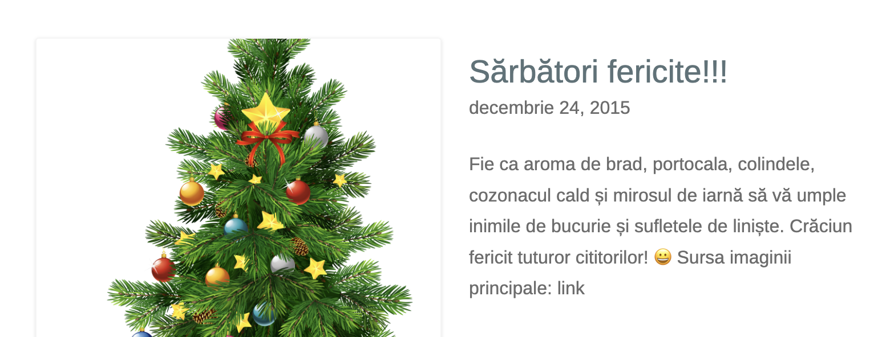

Salut! Bine ai venit în colțul meu de internet.

Mi-am dorit dintotdeauna (de prin clasa a opta, ca să fiu mai precis) să am un blog personal. Ce-i drept, la momentul respectiv căutam doar să fac bani pe net, fiind unul dintre cei mai cunoscuți membri ai forumului [ClubPTC](https://facembani.ro/) -- comunitatea șomerilor români care [câștigă](https://facembani.ro/subiecte/se-mai-poate-face-bani-cu-ptc.72302/#post-720507) 10 cenți, zi de zi, online.

Mai un cent pe NeoBux, mai un satoshi de la un așa-numit _robinet_ de bitcoini, mai un dolar păcălind un copil de pe alt continent să descarce un virus etc. La urma urmei, mentalitatea că banii pot fi câștigați doar dând la sapă nu este altceva decât o tristă consecință a comunismului.

În plus, până și cei mai mari intelectuali ai României au pornit de jos, [promovând scheme MLM](https://ziaristii.com/cum-incercat-proaspatul-aur-ist-mihai-neamtu-sa-l-pacaleasca-pe-criticul-literar-alex-stefanescu-sa-cumpere-produse-pentru-slabit-acum-neamtu-se-declara-scarbit-de-materialismul-occidenta/).

## 🦇 Era WordPress

Pe de o parte, voiam să-mi diversific portofoliul de venituri online, bifând eventual și o sursă pasivă, căci deja mă săturasem să dau click-uri toată ziua pentru 10 sutimi de cent. Pe de altă parte, făcând dribbling printre strategii de SEO și cursuri de blogging marca [Tudor Mateescu](https://zoso.ro/blogsens-ro-teapa-ordinara/), l-am descoperit pe [Zoso](https://zoso.ro/) și am realizat cât de înălțător poate fi să ai propriul tău blog.

Așadar, pe 5 decembrie 2015 am pus bazele [primului meu blog](https://gareth618.wordpress.com/) și am spart gheața publicând articolul [Cum să-ți curăți RAM-ul](https://gareth618.wordpress.com/2015/12/05/cum-sa-curati-ram/). Nici până în ziua de astăzi nu știu dacă forma corectă este _curăți_ sau _cureți_, însă ce știu cu certitudine este că articolul în cauză a fost citit de _peste_ două persoane.

Acest succes formidabil m-a motivat să scriu pentru încă câteva luni, moment în care Evaluarea Națională mi-a acaparat întreaga existență. Laitmotivul priorității academice frângătoare de ego își va face apariția tot mai des în viața mea, luptându-mă până în prezent cu el.

Într-un final m-am dat bătut, dar nu înainte de a crea și o [versiune internațională](https://gareth618en.wordpress.com/) a blogului -- prilej de a-mi pune în valoare cunoștințele de engleză, care pe atunci îmi era de-a dreptul [fluentă](https://gareth618en.wordpress.com/despre/).

## 💡 Era InfoGenius

Timpul a trecut, am participat la primul meu ONI și mi-am dat seama că este un moment propice să încep un blog despre informatică și programare. Mi-am spart pușculița din PayPal cu cei 200 de dolari strânși din PTC-uri și am cheltuit o parte din ei pe hosting WordPress + domeniu. Pe 22 iunie 2017, [InfoGenius](https://infogenius.ro/) a luat naștere.

De fapt, în primul an am folosit domeniul `gareth618.ro`, din lipsă de inspirație. Mi-am dat seama că nu pot face față concurenței -- [`învață.info`](https://invata.info/) și [`tutoriale-pe.net`](https://tutoriale-pe.net/) -- cu acest nume, așa că am decis că am nevoie de niște rebranding. Am venit cu numele InfoGenius și l-am rugat pe un amic de 40 de ani de pe ClubPTC să mă ajute cu un logo nou. Restul e legendă.

Pe lângă faptul că am ajutat sute de oameni să învețe informatică, InfoGenius mi-a oferit un post de web developer la una dintre cele mai prestigioase întreprinderi de IT din capitala istorică și culturală a României. De la aceeași companie am fost dat afară la doar o lună după începerea contractului, telefonic, de către șeful aflat în concediu la mare.

Pentru mai multe detalii (tehnice și nu numai) despre istoria InfoGenius, puteți consulta articolul [InfoGenius v2.0 -- Un nou început!](https://infogenius.ro/infogenius-v2/). Trebuie menționat că, în ciuda faptului că n-am postat nimic de peste doi ani, InfoGenius nu este mort, după cum le place gurilor rele să spună. Îmi trebuie doar niște timp să-l rescriu în Astro și s-o iau de la capăt cu articolele. Nu sunt deloc mulțumit de versiunea sa curentă, nici tehnic și nici editorial.

## 🕊️ Prezentul Perfect

Ce am descoperit lucrând toți acești ani la InfoGenius este că îmi place cu adevărat să scriu. În consecință, mi-am tot dorit de ceva timp să am un blog personal, în care să postez și despre subiecte aflate în afara sferei algoritmice. Ei bine, a venit în sfârșit momentul, mai ales acum că am dobândit o oarecare personalitate și am câteva proiecte de etalat pe aici.

Blogul de față este făcut în [Astro](https://astro.build/) -- de departe cel mai bun generator de site-uri statice. Experiența de developer pe care am avut-o cu acest framework în ultima lună a fost absolut fenomenală. Însă cred că și cea de utilizator este mișto. Doar priviți cum este animată trecerea de la pagina [Blog](/blog/) la o postare particulară. Folosește cele mai noi tehnologii web, pe care Astro le-a încapsulat în doar două linii de cod.

Nu pot să cred din ce motive stupide am evitat Astro și, în general, să-mi simplific munca de web developer. Spre exemplu, mereu am ocolit Markdown-ul ca limbaj de markup pentru conținut. Întotdeauna mi s-a părut că este mai eficient să-mi scriu de la zero propriul limbaj (însoțit desigur de o extensie VSCode pentru syntax highlighting) care să se plieze strict pe nevoile mele particulare, când de fapt ar fi fost îndeajuns să-mi aloc câteva ore pentru a învăța cum se customizează Markdown.

Așa am ajuns să scriu InfoGenius v2.0 în [Gatsby](https://www.gatsbyjs.com/), care între timp a devenit cel mai detestat generator de site-uri statice în comunitatea de web dev. Sunt sigur că acest proiect a contribuit într-o cantitate neneglijabilă la începutul meu de chelie. Chiar se simte bine să nu mai fiu atât de perfecționist.

## 🤔 Idei de Postări

Momentan, din punct de vedere al conținutului, am lucrat destul de mult la pagina [Despre](/despre), merită să aruncați un ochi acolo. În rest, am notat mai jos câteva idei de articole pe care vreau să le scriu în viitorul apropiat.

- [Rewind 2023 & Planuri 2024](/rewind-2023-planuri-2024/)
- [Întâlnire cu un Bagabont](/intalnire-cu-un-bagabont/)
- [Teorie Marxistă de Bază](/teorie-marxista-de-baza/)
- Kazi Ploae și Realismul Capitalist
- Trebuie să Vorbim Despre Palestina
- Experiența Mea de Trei Ani la FII
- Reforma Învățământului Românesc

Probabil ați ghicit deja, mai ales dacă mă cunoașteți, că rolul principal al blogului este cel de platformă ideologică pe care să-mi propag ideile socialiste. Suntem într-un moment de răscruce pentru umanitate și cred că este mai important ca niciodată să dobândim conștiință de clasă.

> Nu-i vina lui Marx,\
> E propagare totalitară în stil pur colonialist.
>
> 
--- Kazi Ploae, [_Zoia_](https://www.youtube.com/watch?v=vZwkGuHdOG8)

Ne vedem în curând cu [al doilea articol](/intalnire-cu-un-bagabont/)!
