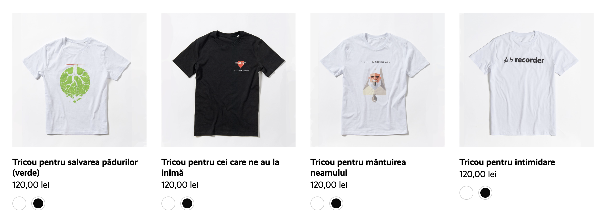
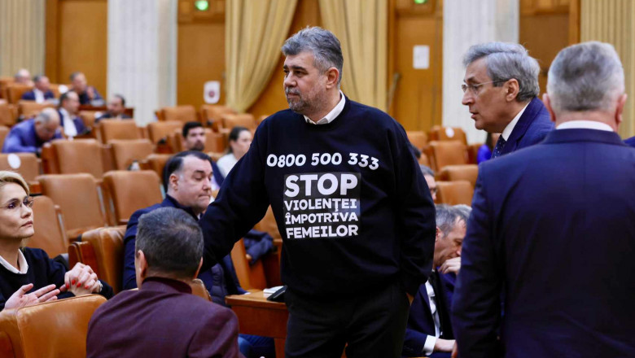

Ca orice cetățean responsabil, fan al democrației, mă uit și eu de vreo trei ani la Recorder. Bineînțeles că n-am nicio problemă cu reportajele lor în sine, ba chiar este crucial să avem presă independentă în România, mai ales devreme ce unele dintre cele mai populare site-uri de știri sunt [trompetele partidelor politice](https://www.hotnews.ro/stiri-politic-26748470-milion-euro-din-bani-publici-pnl-pentru-site-digi24-articolele-nu-fost-marcate-semnul-libertatea.htm). Din fericire, avem și presă independentă, aceasta fiind asigurată de publicații precum [Recorder](https://recorder.ro/), [PressOne](https://pressone.ro/) și [RISE Project](https://www.riseproject.ro/en/). Cu toate acestea, uneori contemplez ce efect concret au reportajele Recorder în rândul urmăritorilor.

## 🌋 Amplificarea Doomerismului

În primul rând, mulți dintre abonații Recorder sunt oameni simpli, dezamăgiți complet de sistem. Sunt convinși că avem mult prea puțină putere pentru a schimba ceva și s-au resemnat de mult timp cu ideea că suntem privați de orice viitor. Pentru ei, aceste reportaje nu fac decât să le amplifice doomerismul. Când, de exemplu, văd reporteri alergați cu toporul prin pădure de către mafia lemnului, normal că vor crede și mai tare că este prea târziu pentru a mai schimba ceva.

Într-o primă fază, ăsta e un lucru bun, de altfel orice revoluție începe prin agitație. Dacă nu ți se oferă motive să fii revoltat, înseamnă că totul este de fapt OK. Problema e că oamenilor li se confirmă inclusiv _motivele_ pentru care cred că s-a ajuns aici, iar acestea mi se par adesea niște idei foarte toxice:

- Nu ne mai facem bine.
- Numai în România se putea întâmpla așa ceva.
- Sunt efectele celor 42 de ani de comunism.
- Ăsta e rezultatul votului nostru.
- Este vina sistemului de învățământ.

Prima idee este pur și simplu autoflagelare și miroase de la o poștă a „suntem noi prea proști, așa că ne merităm soarta”. Pe restul le vom discuta în cele ce urmează.

## 💰 Nu Doar în România Există Corupție

M-am săturat să aud cum la noi corupția a atins cotele pe care le-a atins ca și cum ar fi ceva șocant, ca și cum ar fi ceva specific nouă, fie pentru că suntem români, fie pentru că am trăit patru decenii în comunism. Corupția este de fapt naturală în orice sistem axat pe agonisirea de capital. Mai mult, îi este chiar benefică.

Nu degeaba există conceptul de _lobbying_, prin care corporațiile plătesc politicieni pentru a da legi în favoarea lor, indiferent de costurile aferente la nivel de societate. Un exemplu celebru de lobbying este cel întreprins de companiile petroliere. Acestea finanțează studii „științifice” care să demonstreze inexistența încălzirii globale, legitimizând astfel exploatarea tot mai dereglementată a resurselor naturale ale pământului.

De altfel politicienii, la rândul lor, sunt afaceriști. Chiar dacă nu întotdeauna direct, ci uneori prin intermediari, așa cum, în cazul [scandalului](https://recorder.ro/cartelul-din-carpati/) cu primarul Vlad Oprea, afaceristul este de fapt paravanul său, Beniamin Gonț. Statutul politic le permite acestora să investească, în propriile lor afaceri, capital tras pe dreapta din bani publici. Astfel, interesele clasei capitaliste și cele ale clasei politice se suprapun, creându-se un cerc vicios.

Cât despre ideea că această corupție se petrece doar în statele post-socialiste, este suficient să ne uităm la SUA pentru contraexemplu. Iar pentru cei care consideră SUA un exemplu extrem, ne putem uita și la social-democrațiile europene, unde până și președinții sunt implicați direct în spălare de bani (vezi [cazul](https://en.wikipedia.org/wiki/Nicolas_Sarkozy_corruption_trial) lui Nicolas Sarkozy).

Nu mai zic de cazul Roșia Montană, în care firma Gabriel Resources ~~a venit să ne învețe și pe bieții de noi valorile occidentale~~ a făcut lobby de [miliarde de dolari](https://romania.europalibera.org/a/afacerea-rosia-montana-politicieni-evolutie-actiuni-gabriel-resources/32858316.html) guvernului român, cu scopul ca acesta să-i permită exploatarea zăcămintelor de minereuri prețioase din Roșia Montană, în ciuda impactului devastator asupra mediului înconjurător.

## 🗳️ Democrația Nu Înseamnă Mers la Vot

Ni se spune de mici să stăm în pătrățica noastră și să nu ne batem capul cu politica, fie direct pentru că este curvă, fie pentru că este doar treaba politicienilor (nu că ei ar avea vreo pregătire specială în acest sens), în fața cărora oricum nu avem nicio putere. Suntem învățați că democrația înseamnă doar să mergem la vot, în ideea că, dacă nu am lăsat pe alții să aleagă -- în locul nostru -- ce reprezentant particular al clasei politice să-și umfle portofelul de acum încolo, ne-am făcut datoria de cetățeni responsabili pentru următorii 4-5 ani.

Dacă vrem mai mult de atât, putem chiar să ne uităm la Recorder și să lăsăm comentarii pentru algoritm, precum „Primul!”, „Alex Nedea președinte!” și „Respect!”. Până postează ei, putem continua să sclavim liniștiți la corporație. Și să sperăm că drumul către clădirea de sticlă nu ne va fi blocat de vreun protest spontan.

În ciuda faptului că nu consider votul pe deplin inutil, trebuie să renunțăm la concepția idealistă cum că dreptul la vot trebuie onorat _din principiu_. Metodele de menținere a status-quo-ului, prezentate de către un sistem inerent exploatativ ca fiind _drepturi_, trebuie înțelese ca ceea ce sunt cu adevărat -- _concesii_. Votul ne oferă, înainte de toate, un motiv de a ne enerva pe semenii noștri timp de un mandat pentru că au votat „greșit” sau deloc.

Pentru a înțelege nuanțele acestei idei, să analizăm două scenarii imaginare, relevante în climatul politic actual. În primul scenariu, candidații în turul doi la președinție sunt [Ciolacu](https://www.youtube.com/watch?v=93n-cfNzPOw) și [Geoană](https://www.youtube.com/watch?v=zIrEymjxftI). Ambii sunt exact același lucru, dovadă fiind cele două clipuri asociate. Prin urmare, de ce să ieșim la vot, dând de înțeles susținerea unuia dintre ei? Cu atât mai mult cu cât, în practică, nu președintele are cea mai mare putere în stat, ci prim-ministrul.

Al doilea scenariu îl înlocuiește, în aceeași situație, pe Geoană cu Simion. Ai de ales între un hoț și un fascist. Aici votul contează, dar nu în virtutea unei schimbări în bine, ci în alungarea unei ideologii distructive. În acest context, va mai avea sens să spunem în următorul mandat că votul nostru e de vină? Nu e ca și cum aveam altă opțiune. La fel a fost și cu Iliescu vs. Vadim.

Acestea fiind spuse, cred că votul poate fi cu atât mai relevant cu cât este mai local (primărie) și, eventual, mai depărtat de clasa politică (funcție într-o unitate de învățământ, de pildă cea de rector al unei universități).

## 🛍️ Comodificare și Consumerism

Aici nu sunt prea multe de spus sau de criticat, fiind vorba despre un aspect foarte natural în capitalism. Dăm like din start, ne uităm la reportaj, dăm like la comentariile la fel de enervate pe sistem ca și noi, mai bagă YouTube o reclamă la păcănele și trecem mai departe. Clipurile se transformă în comodități care trebuie consumate. Dorința iluzorie satisfăcută este cea de a fi la curent cu ce se întâmplă în jurul nostru.

Orice luptă împotriva sistemului, mai mult sau mai puțin radicală, este cooptată de capitalism și sfârșește prin crearea de produse fizice. Așa cum observă și Žižek atunci când privește ciocolata [prin lentilele ideologiei](https://www.youtube.com/watch?v=rxvOFeexgU4&t=186s), cumpărând astfel de produse putem rămâne consumeriști cu conștiință curată, știind că sponsorizăm o cauză nobilă, pe umerii căreia putem lăsa toată lupta rămasă, pentru că noi tocmai ne-am făcut partea.

Iată pe încă cineva care poartă tricouri pentru a-și arăta solidaritatea cu diverse cauze pentru care consideră că merită luptat:

## ⚖️ Nevoia de Analize Radicale

Analizele neutre își ating potențialul maxim doar într-o societate cu un spirit critic bine dezvoltat, în care pesimismul și reducționismul descrise mai sus sunt minimizate. Reportajele Recorder ar trebui să ne facă nu doar să conștientizăm problemele cotidiene ale societății românești, ci și să le căutăm rădăcinile prin punerea la îndoială a întregului sistem care le perpetuează. În lipsa unei culturi care să promoveze acest spirit critic, nevoia de analize radicale devine aparentă.

> Spiritul critic decedat doar consumă și se uită.
>
> 
--- Kazi Ploae, [_Singur de Anul Nou_](https://www.youtube.com/watch?v=ZSseEzOxKds)

Urmărirea reportajelor fără crearea unei culturi critice în jurul lor este inutilă, așa cum argumentează și Kinezărie în [acest](https://www.youtube.com/watch?v=AxLySQF7LS8) clip că degeaba reformăm învățământul dacă, odată ieșiți pe porțile școlii, ne lovește aceeași cultură în care succesul este dobândit doar prin corupție și exploatare. Așadar, ce concluzii ar fi de tras uitându-ne la Recorder?

## 🔬 Concluzii din Diverse Clipuri

Mai întâi, două observații pe marginea penultimului clip, anume [Pe Urmele Mafiei Gunoaielor](https://www.youtube.com/watch?v=WHgwT-F05J4). Replica „asta e proprietate privată” este cireașa de pe tortul capitalismului. Nimic nu este mai sfânt decât profitul, așa că mecanismul principal pentru reproducerea sa trebuie apărat cu orice preț, indiferent de consecințele ecologice (vorbim de aruncarea deșeurilor menajere în mijlocul naturii). Până și poliția își pierde autoritatea în fața proprietății private. Câtă vreme profitul rămâne pe primul loc, personaje ca cele din material vor continua să existe, iar tragerea lor la răspundere -- cu toate că necesară -- nu va rezolva cauza, ci doar efectul.

Altă replică relevantă este „dar e legal”. Trebuie să înțelegem că legea este făcută de către hoți, pentru hoți, și că statul este un aparat de represiune menit să apere interesele clasei conducătoare. De aia suntem [bătuți la protestele](https://www.youtube.com/watch?v=OF4fu3BS_Vc) cu miză reală și de aia legile care sunt în interesul nostru stau ani la rând să fie aprobate. Asta în timp ce Iohannis tocmai a promulgat [legalizarea evaziunii fiscale](https://www.digi24.ro/digieconomic/financiar/iohannis-a-dat-decret-evaziunea-fiscala-sub-1-milion-de-euro-nu-mai-e-inchisoare-daca-se-plateste-prejudiciul-18075).

Un alt clip care m-a emoționat la vremea lui a fost [Ce Te Sperie la Ziua de Mâine?](https://www.youtube.com/watch?v=amgXE5M11pk). La final, un pakistanez ne vorbește despre cum a venit în România să lucreze ca livrator, pentru a-și putea întreține familia rămasă acasă. Multe comentarii spun că ar trebui să învățăm o lecție despre luptă și optimism de la dânsul, lucru cu care sunt parțial de acord. Însă nimeni nu menționează cât de ridicol este că, în acest cel mai avansat stadiu al civilizației umane, ești forțat să pleci la câteva mii de kilometri de casă, să sclavești toată ziua pentru minimul pe economie, toate astea în timp ce corporația nu-ți oferă nicio asigurare în cazul vreunui accident sau al vreunei defecțiuni a vehiculului.

## 🎉 Optimism Revoluționar

În clipa în care am spus „nu ne mai facem bine” am sugrumat orice dorință reală de a schimba ceva. Suntem mult mai puternici decât credem, pentru că nimic din toate relele din lume nu s-ar întâmpla fără sprijinul indirect al clasei muncitoare. Noi suntem cei care putem refuza să transportăm gunoi pentru a fi aruncat în locuri ilegale, noi putem refuza să tăiem arbori seculari, noi putem refuza să fabricăm armament trimis să omoare copii în Gaza.

Pe lângă a ne uita la Recorder, trebuie să mergem la proteste, să semnăm petiții, să ne educăm politic (ideea de a fi _apolitic_ este o minciună: politica îți influențează toate aspectele vieții, așa că nu-i o idee bună să fii indiferent față de ea), să punem presiune publică pe clasa politică și să milităm pentru schimbări radicale. Revoluția din '89 nu și-a atins mai deloc scopul. Să treacă 35 de ani și să dăm vina tot pe noi și pe cum suntem niște proști care „își merită soarta” este pur și simplu ridicol și ignorant.
