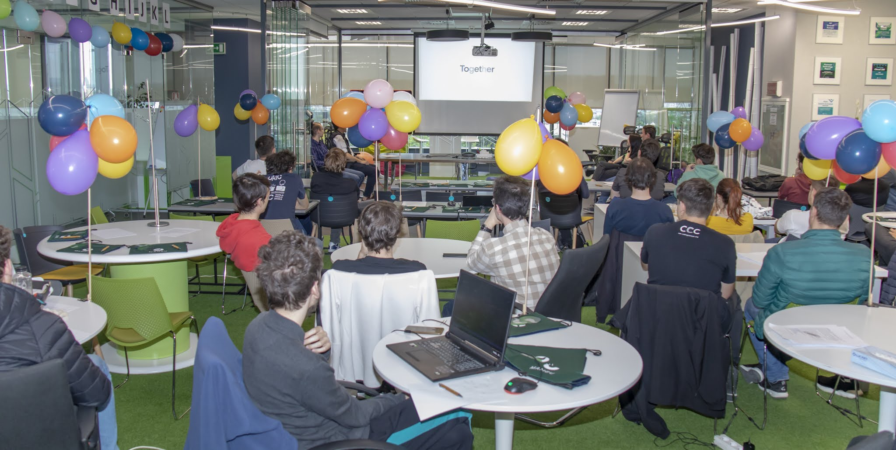

De aproape o lună vreau să scriu o postare pe tema asta, dar abia alaltăieri am terminat de codat blogul. 2023 nu a fost cel mai bun sau cel mai aparte an al meu, dar sunt destul de sigur că a fost cel mai plin de activități.

## 🐌 Carieră

În primul rând, în 2023 am absolvit prestigioasa facultate de informatică din inima Moldovei. Am trecut prin ultimul și cel mai penibil semestru, culminând cu mult așteptata susținere a licenței. Aceasta a fost bazată pe un [articol](https://arxiv.org/abs/2305.13008) trimis la o conferință de criptografie de rangul B, unde cumva a fost acceptată. Mă întristează puțin gândul că nu se va mai uita nimeni pe ea, de vreme ce reprezintă un [paper](https://ioleniuc.ro/articole/thesis-paper.pdf) mult mai detaliat și clar decât articolul de la conferință în sine. Acela a fost scris în grabă și în echipă, pe când la licență am lucrat intens timp de o lună întreagă.

În ceea ce privește activitatea didactică, pe lângă faptul că am început al treilea meu an de predat la InfoGym, am ținut și primele mele ore în facultate: două laboratoare de IP (Introducere în Programare) și un curs de PC (Programare Competitivă). Mai mult, după multe refuzuri din partea mea, anul acesta am acceptat pentru prima oară să fac pregătire cu cineva pentru olimpiadă. Mai precis, antrenez un băiat pentru OJI și chiar îmi place.

La capitolul web dev, nu-mi vine să cred, dar abia anul acesta am terminat site-ul pentru [Crucea Roșie Iași](https://crucearosieiasi.ro/). De asemenea, am lucrat la un proiect -- să zicem, în domeniul financiar -- cu care abia aștept să termin. În rest, mi-am făcut un tool pe care-l folosesc zi de zi pentru luat notițe, numit [PasteMd](https://pastemd.netlify.app/) (PasteBin dar pentru Markdown). În anul 2023 am învățat SCSS, TypeScript, GraphQL, SupaBase, dar și puțin [WASM](https://github.com/gareth618/numerical-analysis) (am rulat cod Python în Web Assembly!) și [MongoDB](https://github.com/gareth618/music-app).

## 🏟️ Concursuri

În privința concursurilor, de care în mod normal nu prea îmi mai pasă, pot să mă laud cu două faze. Am luat locul I la ISCPC (faimosul concurs internațional de informatică pentru studenți, cu o tradiție de peste 40 de ani, ce adună anual studenți din peste 100 de țări -- etapa pe Iași)! Această reușită se datorează în primul rând neparticipării echipelor de elevi, care în mod uzual îi îngenunchează chiar și pe cei mai veterani dintre studenți.

Apoi, am câștigat locul I pe facultate la un concurs de AI (Cloudflight Coding Contest), de unul singur, surclasându-mi chiar și prieteni care au deja o vechime respectabilă (de peste 12 luni!) în industrie. Am câștigat datorită unei rețele neuronale de trei linii, în condițiile în care, la acest capitol, cel mai avansat lucru pe care îl cunosc este cum funcționează [backpropagation](https://ioleniuc.ro/articole/neural-networks.pdf).

## 🎭 Cultură

2023 a fost probabil cel mai plin de lecturi an, cu toate că am citit mult mai rar decât mi-aș fi dorit. Avem 13 cărți. Literatură, socialism și mult Eric Schmitt:

- Ferma Animalelor
- Manifestul Partidului Comunist
- Feminist(ă). Feminiști
- Dragă Ijeawele: Un Manifest Feminist în 15 Sugestii
- Otrava Iubirii
- Milarepa
- Felix și Izvorul Invizibil
- Realism Capitalist
- Trei Povești de Dragoste
- De ce Iubim Femeile
- Școlărița
- Cartea Râsului și a Cercetării
- Dacă Pisicile ar Dispărea din Lume

Am văzut [59 de filme](https://letterboxd.com/gareth618/films/diary/for/2023/) și 4 seriale: Rick and Morty (am vrut să aflu și eu care-i faza cu el), Gravity Falls (văzusem sezonul 1 acum vreo 10 ani, eram mare fan pe atunci și am zis să-l termin, a meritat din plin), Ted Lasso și Big Little Lies (absolut superbe).

## 🚂 Excursii

Anul acesta am făcut incredibil de multe excursii (deplasări în afara orașului). Mai precis 9, din care doar una cu ai mei! Și am mers pentru prima oară într-o excursie de unul singur, unde mi-am făcut de cap prin Clooj, mâncând fine dining și urcând pe munte (Cheile Turzii). O altă noutate este că am vizitat și eu în sfârșit capitala.

- Piatra-Neamț cu Radu și Mike
- Vatra Dornei cu Radu
- Vaslui cu Liz, Gabi și Sof (Open Camp Vaslui)
- Suceava cu Andreea, Mihai, Liz și Gabi
- Tecuci cu Luca (întâlnire de afaceri)
- Vama Veche cu ai mei (Sunset Festival)
- Cluj singur
- Tecuci cu Alex și Ovidiu (nunta lui Andrei)
- București cu Liz, Gabi și Gabriel

## 🎤 Concerte RAP

Am fost la Sunset Festival, unde i-am văzut pentru prima oară pe CTC, Studiou' P și mulți alții (dar cu care sunt mai puțin familiar) și pentru a doua oară pe Specii. A fost rupere la toate cele trei acte.

Pe final de an am mers la un concert Cedry2k, mai mult de curiozitate, având în vedere că știu ce fel de om este. A fost o atmosferă destul de dubioasă -- omul are, cel puțin în Iași, numai fani de 15 ani, și ăia puțini. Iar după câteva piese în care vorbește despre cât de nașpa sunt evreii și altele două în care rostește rugăciuni te cam saturi. De asemenea, este un pic fioros cum îi ies ochii din orbite pe final de vers. Măcar am putut asculta bucăți vechi și bune, ca Balboa. Mai degrabă mi-a plăcut Pietonu.

Într-o seară din excursia în capitală am mers la prelansarea albumului 1000 de Valuri, semnat Faust & Nu'. Am fost o mână de oameni -- vreo 30. A fost cel puțin interesant să mă aflu atât aproape de rapperii mei, plus că în public am stat fix lângă David Skunk. Păcat că n-am putut rămâne la after.

## ✨ Personal

Am întreprins tot felul de activități sociale în 2023: cinema, ateneu, teatru, operă, ping-pong, biliard, padel, tenis, alergat și jucat table (nu-s eu cu șahul sau alte jocuri de informaticieni). Și mi-am făcut un prieten nou!

Am ținut primul meu speech în fața unei audiențe cu adevărat mari -- sala de festivități a fostului meu liceu. Am vorbit, cu exemple concrete, despre importanța înțelegerii profunde și intuitive a ceea ce învățăm la mate și info. Am vrut să fie altceva decât _concursurile te ajută în carieră_.

Am învățat să empatizez mai bine cu oamenii. Să fiu mai selectiv cu lucrurile cu care să-mi bat capul. Să nu am așteptări de la ceilalți. Să ies mai ușor din zona de confort. Să fiu mai puțin perfecționist. Să-mi argumentez mai bine punctele de vedere. Să mă iubesc ceva mai mult.

## 🎆 Planuri 2024

Momentan știu că anul acesta o să merg (acuși) în Croația, într-o tabără de tip ICPC, ca antrenor. Și mai știu că în semestrul al doilea o să țin la două grupe seminarul de PA (Proiectarea Algoritmilor) și o treime din orele de PC (Programare Competitivă), unde sper să fac treabă bună. Mai doresc să aplic după sesiune la un internship de cercetare în Bulgaria pentru vară (**edit:** a fost o țeapă totală). În rest, planurile mele principale sunt:

- 2/1000 KM pe bicicletă (dar mai întâi să ~~trec pe la~~ o aduc de la service)
- 2/15 excursii (deplasări în afara Iașului) {/* București Chimie, Osijek OCPC */}
- 2/25 de cărți (literare și nonliterare) {/* Zahir, Amurg */}
- 5/10 concerte RAP (asta presupune multe deplasări la București) {/* Chimie, Vlad Dobrescu, Psihotrop, Specii, Faust */}
- să ajung la 92/80 KG (de la 95 KG)
- să mă reapuc de proiectul [InfoGenius](https://infogenius.ro/) și să-l duc pe cele mai înalte culmi

## 📖 Lecturi

Astea sunt cărțile pe care le-am cumpărat sau le-am primit cadou și nu am apucat să le citesc sau să le termin de citit. Vreau să le bifez cât mai repede, pentru că de fiecare dată când intru în Cărturești mă atrag cărți noi, dar nu-mi vine să le cumpăr atâta vreme cât mai am de citit acasă.

- ~~Zahir~~
- How Much Land Does a Man Need?
- Only Dull People Are Brilliant at Breakfast
- ~~Amurg~~
- Dezumanizat
- A Modern Detective (începută)
- Din Cer Au Căzut Trei Mere
- 1984
- Pride and Prejudice
- Capitalul (variantă din Cărturești)
- Capitalul (variantă din Scoția)
- Uită de Griji, Începe să Trăiești (începută)

Apoi aș vrea să mă apuc de Mircea Cărtărescu și, în general, de autori români. Cu toate că sunt curios și de Kranz Fafka.

## 🛠️ Socialism

Vreau să citesc lucrările de mai jos. Pe lângă asta, aș vrea foarte mult să mă implic într-un proiect mai mare din sfera socialismului -- fie un voluntariat sau ceva în folosul comunității, fie o serie de texte care să sporească conștiința de clasă (o idee ar fi să documentez genocidul din Palestina).

- [Wage Labour and Capital](https://www.marxists.org/archive/marx/works/1847/wage-labour/) -- Karl Marx
- [Value, Price and Profit](https://www.marxists.org/archive/marx/works/1865/value-price-profit/) -- Karl Marx
- [The Principles of Communism](https://www.marxists.org/archive/marx/works/1847/11/prin-com.htm) -- Friedrich Engels
- [Socialism: Utopian and Scientific](https://www.marxists.org/archive/marx/works/1880/soc-utop/) -- Friedrich Engels
- [Origin of the Family, Private Property and the State](https://www.marxists.org/archive/marx/works/1884/origin-family/index.htm) -- Friedrich Engels
- [What Is To Be Done?](https://www.marxists.org/archive/lenin/works/1901/witbd/) -- Vladimir Lenin
- [``Left-Wing" Communism: an Infantile Disorder](https://www.marxists.org/archive/lenin/works/1920/lwc/) -- Vladimir Lenin
- [Imperialism, the Highest Stage of Capitalism](https://www.marxists.org/archive/lenin/works/1916/imp-hsc/) -- Vladimir Lenin
- [The State and Revolution](https://www.marxists.org/archive/lenin/works/1917/staterev/) -- Vladimir Lenin
- [Reform or Revolution](https://www.marxists.org/archive/luxemburg/1900/reform-revolution/index.htm) -- Rosa Luxemburg
- [On Practice](https://www.marxists.org/reference/archive/mao/selected-works/volume-1/mswv1_16.htm) -- Mao Zedong
- [On Contradiction](https://www.marxists.org/reference/archive/mao/selected-works/volume-1/mswv1_17.htm) -- Mao Zedong
- [The Social Basis of the Woman Question](https://www.marxists.org/archive/kollonta/1909/social-basis.htm) -- Alexandra Kollontai
- [The Labour of Women in the Evolution of the Economy](https://www.marxists.org/archive/kollonta/1921/evolution.htm) -- Alexandra Kollontai
- ~~[Communism and the Family](https://www.marxists.org/archive/kollonta/1920/communism-family.htm)~~ -- Alexandra Kollontai

De asemenea, vreau să merg la măcar un protest sau marș. Anul trecut am fost cât pe ce să merg la un marș pentru feminism (dar a plouat nașpa). Anul acesta am ocazia să merg la primul meu Pride!
