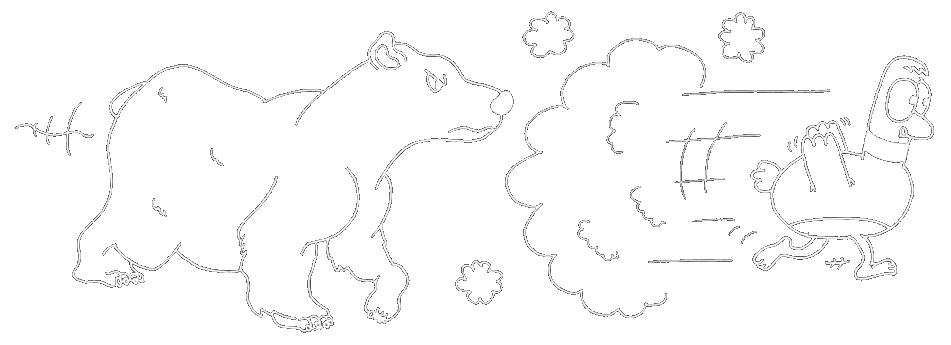
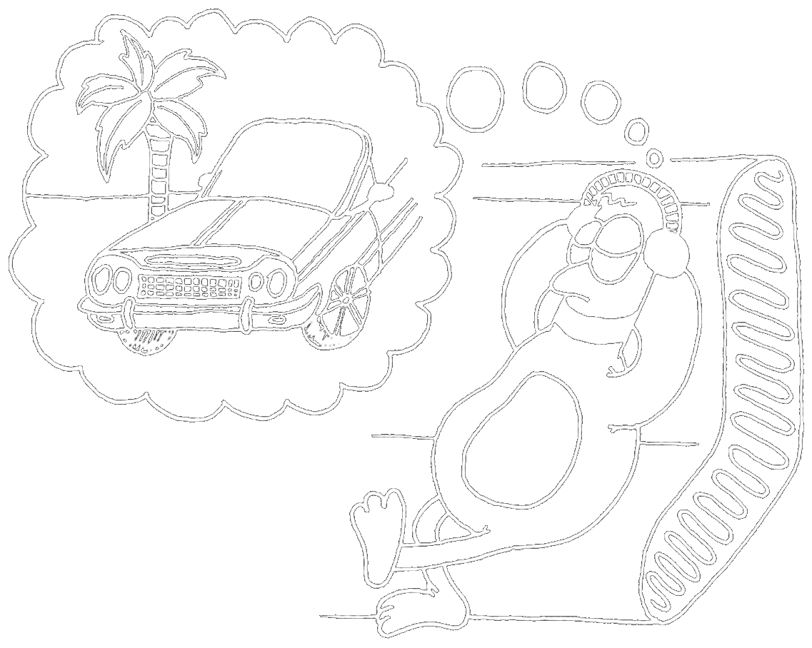

import IconHeader from '../components/general/IconHeader.astro'
export const components = { h2: IconHeader }

import PaperCollection from '../components/collections/PaperCollection.astro'
import ProjectCollection from '../components/collections/ProjectCollection.astro'
import TechnologyCollection from '../components/collections/TechnologyCollection.astro'
import SerialCollection from '../components/collections/SerialCollection.astro'
import BookCollection from '../components/collections/BookCollection.astro'
import AlbumCollection from '../components/collections/AlbumCollection.astro'

**Bine ați venit în colțul meu de internet!** Aici o să-mi găsiți cam toate creațiile digitale ([articole](/articole/) cvasi-științifice și [proiecte](/proiecte/) _mostly_ web), iar pe această pagină o să mențin liste cu diverse tipologii de conținut pe care le consum -- filme, seriale, cărți și albume. Pe lângă cele menționate anterior, acest website dispune și de un [blog](/blog/), pe care abia aștept să-mi dau cu părerea despre tot felul de chestii de care nu m-a întrebat nimeni.

## 🦆 Cine Sunt?

Numele meu este **Iulian Oleniuc** (AKA **Gareth, Rățoiul Verde**), am {new Date() < new Date(new Date().getFullYear(), 2, 21) ? new Date().getFullYear() - 2003 : new Date().getFullYear() - 2002} de ani și sunt student la masterul de Studii Avansate în Informatică din cadrul UAIC, unde pretind că fac research în zona de criptografie, mai precis pe tema **Key-Policy Attribute-Based Encryption**. Mă pasionează matematica, filosofia politică, cultura hip-hop (cu precădere cea autohtonă) și pinguinii.

  

În afara facultății, care îmi mănâncă zilele, îmi ocup timpul cu activități algoritmice (scris pe InfoGenius, predat la InfoGym, organizat FIICode, comisie OJI/ONI, pregătiri OJI), citind Eric Schmitt și contemplând marii gânditori ai istoriei, de la Karl Marx până la Kazi Ploae. Din când în când, mă regăsesc făcând web dev, lucrând la site-uri precum cel de față. Totodată, în funcție de sezon, mai ies pe afară cu bicla sau mai fac câte-o excursie.

  

## 🤔 Chestii Random

- Odată [am petrecut 3 ore](/intalnire-cu-un-bagabont/) vorbind despre marxism cu un bagabont de pe stradă.
- În clasele 7-8 eram un membru de vază al [**ClubPTC**](https://facembani.ro/) -- comunitatea șomerilor români care fac bani online din crypto, site-uri paid-to-click, scheme MLM și alte prostii.
- Prima mea linie de cod am scris-o în clasa a 3-a la Palatul Copiilor, în răposatul limbaj **Turbo Pascal**.
- Lucrez din 2017 la blogul meu despre informatică și programare [**InfoGenius**](https://infogenius.ro/), unde n-am mai scris de doi ani.
- Ascult hip-hop din clasa a 7-a, când profa de desen ne-a pus la videoproiector piesa [**Without Me**](https://youtu.be/YVkUvmDQ3HY) de Eminem.
- Pot să-mi pocnesc genunchiul drept aproape oricând îmi doresc.
- În clasa a 10-a am făcut Educație Antreprenorială cu un prof care ne îndemna să citim sfânta scriptură a capitalismului **Tată Bogat, Tată Sărac** și să cumpărăm Bitcoin și Ripple pentru a ajunge pe lună.
- În tinerețe am scris un plugin pentru WordPress în PHP.
- O singură dată am încercat și eu să copiez la un test, însă nu mi-am mai aflat nota deoarece profa decedase ulterior.
- De la primul și momentan ultimul meu job oficial am fost concediat telefonic de către șeful care era în concediu la mare.
- În gimnaziu am creat o serie de benzi desenate intitulate **Gareth, Rățoiul Verde**, despre un rățoi de 60 de kile.
- În BAC la română am luat nota 7.50. Contestația a mărit-o la 8.20, dar prefer să mă laud cu nota dintâi.
- În clasa a 5-a am obținut punctajul 99.50 la DELF A1. Acum abia dacă mai știu să scriu cum mă cheamă în franceză.
- În clasa a 8-a am fost într-o tabără unde Mircea Cărtărescu mi-a spus că ar trebui să zâmbesc mai des.

## 🔗 Link-uri Utile

- [Reddit](https://www.reddit.com/user/gareth1618) | [Twitter](https://twitter.com/gareth618) | [Letterboxd](https://letterboxd.com/gareth618/)
- [GitHub](https://github.com/gareth618) | [LinkedIn](https://www.linkedin.com/in/iulian-oleniuc-86954827b/) | [Curriculum Vitae](/cv.pdf)
- [Canal Concerte](https://www.youtube.com/channel/UCUSrngBTwmxkV9c3TjLq4Xw) | [Canal Animații](https://www.youtube.com/channel/UCOAKjb1sQr0A2pBTl1XH4BA) | [Fost Canal Mate](https://www.youtube.com/channel/UCm8ertdGT17hQXmo1FRl3mA)

## 📚 Articole

Pagina [Articole](/articole/) conține o listă completă cu articolele -- mai mult sau mai puțin științifice -- scrise de mine, care nu au fost postate pe [InfoGenius](https://infogenius.ro/). Majoritatea sunt lecții pentru InfoGym, dar există și unele scrise din proprie inițiativă, cum ar fi cel despre rețele neuronale. Desigur, nu am urcat zecile de teme pentru facultate, deoarece ar fi scoase din context și și-ar pierde valoarea. Mai jos aveți articolele de care sunt cel mai mândru.

<PaperCollection selection={[2, 4, 8]} />

## 🚀 Proiecte

Pagina [Proiecte](/proiecte/) conține o listă cu cele mai relevante proiecte de pe [GitHub](https://github.com/gareth618)-ul meu. Majoritatea sunt site-uri web, iar unele dintre acestea sunt chiar live. Mai jos le-am listat pe preferatele mele. Site-ul pentru Crucea Roșie este mai special -- din moment ce a fost un proiect plătit, nu pot publica codul sursă.

<ProjectCollection selection={[1, 2, 3, 4]} />

## 💻 Tehnologii Cunoscute

Aici am listat în mare parte tehnologii web, dar și niște limbaje mai generale. Ador C++ pentru programare competitivă, sunt hater Java -- cu toate că, fiind primul meu limbaj în care am făcut jocuri, am fost un mare fan în adolescență -- și îmi place Python pentru chestii high-level (criptografie și algebră liniară).

Cu toate că înțeleg CSS în mod profund, am învățat mai nou Tailwind (odată cu acest blog) și cred că nu voi mai renunța la el niciodată. SupaBase este cu mult peste FireBase, în primul rând pentru că funcționează bine cu TypeScript. Cu React și mai ales Gatsby am avut o experiență oribilă. Vue este mult mai mișto decât React ca paradigmă, iar Nuxt este fix ce trebuie, mai puțin la capitolul generării de site-uri statice, unde Astro mi se pare soluția absolut perfectă.

<TechnologyCollection />

## 🍿 Filme și Seriale Văzute

Lista completă de filme pe care le-am văzut vreodată se află pe [Letterboxd](https://letterboxd.com/gareth618/). Este mult prea greu să fac un top cu preferatele mele (câteva) all-time, dar există, orientativ, [această](https://letterboxd.com/gareth618/likes/films/) pagină. Iată însă o listă cu puținele _seriale_ pe care le-am văzut până acum -- acestea, de obicei, nu pot fi logate pe Letterboxd.

<SerialCollection />

## 📖 Cărți Citite

Aproape dintotdeauna mi-a plăcut să citesc, însă abia după BAC am început să am cât de cât timp de această activitate aristocrată. Mai jos găsiți așadar lista lecturilor mele relevante, excluzând deci cele câteva opere pentru școală, **Jurnalul unui Puști** și altele asemenea. Totodată voi exclude cărțile pur științifice, cum ar fi **Introduction to Algorithms** (care mi-a schimbat viața).

<BookCollection />

## 💿 Albume Preferate

  

    Mă refer la albume de hip-hop românesc. Mi se pare mult mai interesant decât cel american, sub aripa căruia oricum mi-am trăit o grămadă de ani, ascultând toți clasicii -- de la Lakim Shabazz și RA the Rugged Man, până la Wu-Tang Clan și Cypress Hill.

    

    RAP-ul românesc este mai relatable, este cel puțin suficient de divers, prezintă proiecte complet originale (Specii, Subcarpați și Silent Strike) și oferă câțiva artiști a căror profunzime rar am întâlnit-o la americani (Kazi Ploae și Norzeatic). Paragraful de față a încercat doar să fie un îndemn către fanii hip-hop-ului american de a arunca o ureche și peste cel românesc, pentru că merită.

    

    Ah, iată că am făcut și un top cu 100 de piese: [Romanian Hip-Hop](https://open.spotify.com/playlist/2DiZtCK0ZSouy4jITLDXfs?si=21e3000543814ae5)!
  

  

    
  

<AlbumCollection />
